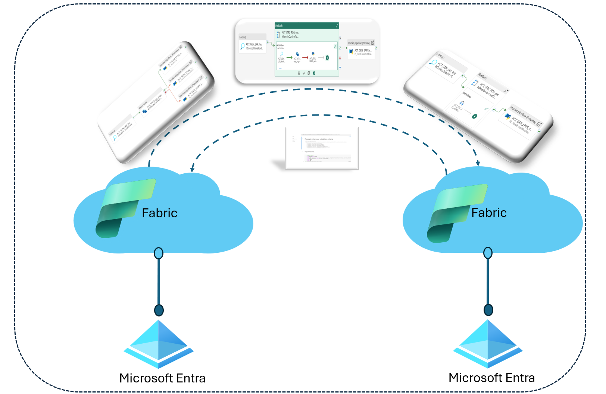
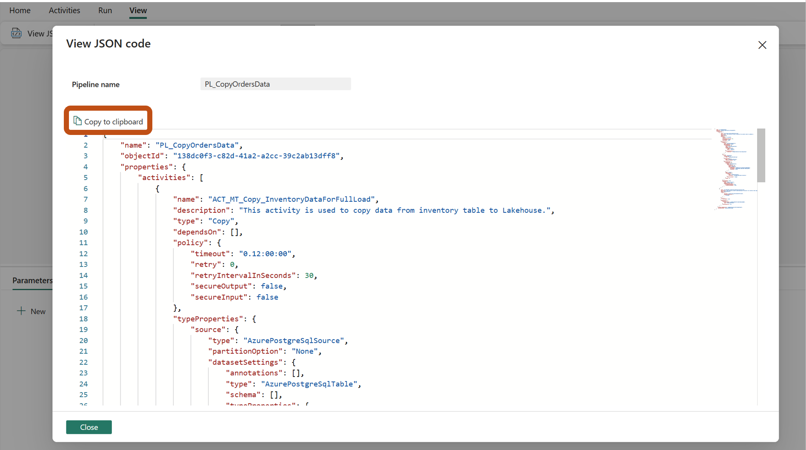
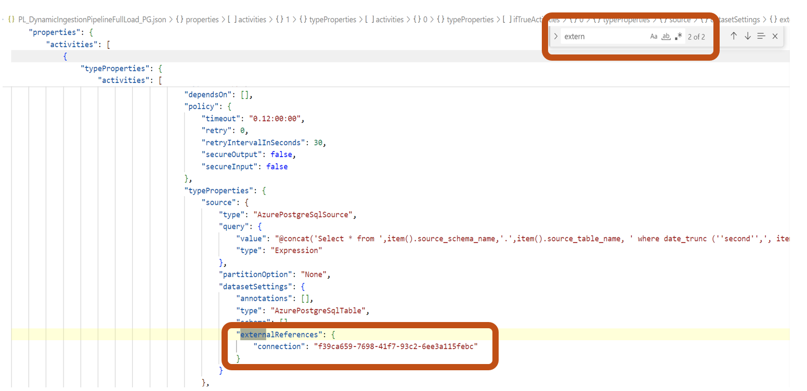

# FabricAutomatedDataPipelineDeployment

One of the significant use case we often hear from our customer is the ability to migrating resources across tenants. Supporting tenant migration is crucial for maintaining flexibility, scalability, and resilience in a multi-tenant environment. This capability allows businesses to adapt to changing needs and conditions effectively.Through we have multiple ways to migrate various resources including notebooks,data in lakehouses, Power BI but we don't have similar feature in Microsoft Fabric.In Azure Data Factory (ADF), We had import & export of pipelines facility which made it super easy for customers or even ISV's to reuse and redeploy the pipelines.This repository is used to automate the Fabric data pipeline deployment within same tenant & cross tenant deployment. To make it simple, I have divided it into 3 step process.

**Pre-requisites**
# STEP 1 Create Workspace,Lakehouse & Data Warehouse in destination Tenant
1. A Fabric **Destination workspace** is needed where Fabric data pipelines need to be deployed. This can be an **existing workspace or a new workspace**. Get the e.g. Workspace ID - 66a92280-b91b-408e-bdd5-0276ad7d35a1.
1. Within this workspace, create a **Lakehouse** or identify **existing lakehouse** where the data needs to be ingested in **Destination workspace**.
    - Get the Lakehouse ID e.g. a1e8b2fe-7527-40b7-a137-648be36a6602
    - Get the SQL analytics endpoint e.g. x6eps4xrq2xudenlfv6naeo3i4-qarkszq3xghebpovaj3k27jvue.msit-datawarehouse.fabric.microsoft.com
    - Get the name e.g. CMFLHStore
1. **Optional - Only if your pipeline uses Warehouse.** Create a **Warehouse** or identify existing warehouse where the metadata needs to be ingested in **Destination workspace**.
     - Get the Warehouse ID e.g. 4114775b-f303-4e3f-b230-c31c555466d8
     - Get the SQL connection String - x6eps4xrq2xudenlfv6naeo3i4-qarkszq3xghebpovaj3k27jvue.msit-datawarehouse.fabric.microsoft.com
     - Get the Datawarehouse Name  - CMFDWStore

# STEP 2 Identify Data Pipelines to be migrated & save the assets.
1. Identify the data pipelines to be deployed.For all the pipelines that are deployed, Go to the pipeline & select "View JSON code".

1. Go to "Copy to clipboard" & "Close".
  
  Save the Json & upload the Json in the lakehouse in Destination workspace.

# STEP 3 Identify external connections & create connections in destination tenant
1. Identify External connections/references used in pipelines. External references could be an Azure PostgreSQL DB connection or Azure SQL DB connection or even  Blob Storage/ADLS Gen2 storage in Azure in the data pipeline. You can use "" in scripts to identify the list of extenal connections & their corresponding id in your pipeline. **Note** If your pipeline is simple you can do a find & note the connection id.

1. Create connections in new Tenant for the external references for the source Azure data stores from where you want to ingest data. We have PostgreSQL DB & Blob Storage/ADLS Gen2 storage in Azure. 
Create connections by going to "Settings" -> "Manage connections and gateways" -> "New". Once the new connection is created save the new connection id.

# STEP 4 Update pipeline deployment config files
1. Open **"pipeline_deployment_config.yml"** & Update the DestinationDatawarehousedetails & DestinationLakehousedetails as highlighted in the below with the details of obtained from above step 2 & 3. figure.

Similarly create connection for ADLS Gen2 storage in Azure & get the connection ID details.

**Note** - If the connections to same source are already present then only get the details of connection id._

1. Update the externalreferences configuration in **"pipeline_deployment_config.yml"**  for PL_Auditing_PG,PL_PopulateMetadataTable_PG,PL_DynamicIngestionPipelineIncrmLoad_PG,PL_DynamicIngestionPipelineFullLoad_PG as highlighted in below figure.

1. Upload the Json files & the updated pipeline_deployment_config.yml file in the lakehouse as shown in the below figure.

--------------------

# STEP 3
1. Import the "DeployTrinityIngestionFramework" notebook.

1. Please make sure that lakehouse where we have the Json & YAML files are marked as default.

1. Execute the "DeployTrinityIngestionFramework" notebook.
