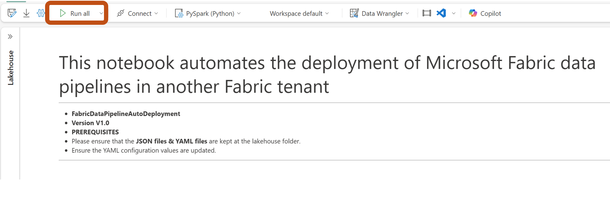

# FabricAutomatedDataPipelineDeployment

One of the significant use cases we often hear from our customers is the ability to migrate resources across tenants. Supporting tenant migration is crucial for maintaining flexibility, scalability, and resilience in a multi-tenant environment. This capability also allows businesses to reuse and redeploy pipelines across tenants.

For those familiar with Azure Data Factory (ADF), you know that its import and export capabilities have made pipeline migration a breeze, enabling customers and ISVs alike to reuse and redeploy pipelines across tenants.

This repository can be used to automate the Fabric data pipeline deployment within the same tenant and for cross-tenant deployments. To make it simple, I have divided it into a 5-step process.

# STEP 1 Create Workspace,Lakehouse & Data Warehouse in destination Tenant
**Pre-requisites**
1. A Fabric **Destination workspace** is needed where Fabric data pipelines need to be deployed. This can be an **existing workspace or a new workspace**. Get the e.g. Workspace ID - 66a92280-b91b-408e-bdd5-0276ad7d35a1.
1. Within this workspace, create a **Lakehouse** or identify **existing lakehouse** where the data needs to be ingested in **Destination workspace**.
    - Get the Lakehouse ID e.g. a1e8b2fe-7527-40b7-a137-648be36a6602
    - Get the SQL analytics endpoint e.g. x6eps4xrq2xudenlfv6naeo3i4-qarkszq3xghebpovaj3k27jvue.msit-datawarehouse.fabric.microsoft.com
    - Get the name e.g. CMFLHStore
1. **Optional - Only if your pipeline uses Warehouse.** Create a **Warehouse** or identify existing warehouse where the metadata needs to be ingested in **Destination workspace**.
     - Get the Warehouse ID e.g. 4114775b-f303-4e3f-b230-c31c555466d8
     - Get the SQL connection String - x6eps4xrq2xudenlfv6naeo3i4-qarkszq3xghebpovaj3k27jvue.msit-datawarehouse.fabric.microsoft.com
     - Get the Datawarehouse Name  - CMFDWStore

# STEP 2 Identify Data Pipelines to be migrated & save the assets.
1. Identify the data pipelines to be deployed.For all the pipelines that are deployed, Go to the pipeline & select "View JSON code".

1. Go to "Copy to clipboard" & "Close".
  
  Save the Json & upload the Json in the lakehouse in Destination workspace.

# STEP 3 Identify external connections & create connections in destination tenant
1. Identify External connections/references used in pipelines. External references could be an Azure PostgreSQL DB connection or Azure SQL DB connection or even  Blob Storage/ADLS Gen2 storage in Azure in the data pipeline. You can use "IdentifyExternalInternalConnections.ipynb" in scripts to identify the list of extenal connections & their corresponding id in your pipeline.
As a pre-requisite for this, update the value of “identifyconnections_deployment_config.yml” file with
  pipelinedisplayname — The Name of the data pipeline
  pipelinejsonfilepath — The file path of the data pipeline; as shown in below figure.

  
1. Execute “IdentifyExternalInternalConnections” notebook in the nootbook folder. Make sure that you have attached & pinned the right lakehouse before executing the notebook.

1. After executing below output is obtained.

With this we have identified that we have an external connection so go to Settings in Source tenant -> Manage Connections, identify the connection type e.g. PostgreSQL, SQL DB based on the ID obtained from above step.

1. Once the external connection type for the source tenant is identified, We need to create the external connection in destination tenant. Please follow below steps to create a new connection & obtain the new ConnectionID. Please note that this will be used further.
Create connections by going to "Settings" -> "Manage connections and gateways" -> "New". Once the new connection is created save the new connection id.

# STEP 4 Update pipeline deployment config files
1. Below figure shows the YAML configuration file for deploying the fabric data pipelines.

Note - Always make sure that all the child pipelines are included first in the YML file.

# STEP 5
1. Import the "FabricDataPipelineAutoDeployment" notebook.
1. The final step is to Run the “FabricDataPipelineAutoDeployment” notebook.Make sure that you have attached & pinned the right lakehouse before executing the notebook.

--------------------------------------------------------------------

